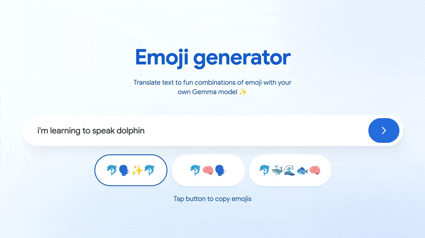

# Emoji generator web app
This demo runs a [Gemma 3 270M IT](https://huggingface.co/google/gemma-3-270m-it) model fine-tuned for text-to-emoji translation directly in the browser. Gemma 3 is supported by web AI frameworks that make deployment easy. Run the app using either:

* **[MediaPipe LLM Inference API](./app-mediapipe)** - Requires a LiteRT model in a `.task` bundle
* **[Transformers.js](./app-transformersjs)** - Requires an `.onnx` model

If you don't have a fine-tuned model, view the resources below. 

Preview the app on [Hugging Face](https://goo.gle/emoji-gemma-demo).

## Resources

You can use these notebooks in Google Colab for fine-tuning and optimizing Gemma 3 270M for web. To fine-tune the model for the emoji translation task, you can either create your own dataset or use our [premade dataset](./resources/Emoji%20Translation%20Dataset%20-%20Dataset.csv).

| Notebook  | Description |
| ------------- |-------------|
| [Fine-tune Gemma 3 270M](./resources/Fine_tune_Gemma_3_270M_for_emoji_generation.ipynb)   | Fine-tune Gemma for emoji translation using Quantized Low-Rank Adaptation (QLoRA) |
| [Convert to MediaPipe](./resources/Convert_Gemma_3_270M_to_LiteRT_for_MediaPipe_LLM_Inference_API.ipynb) | Quantize and convert your fine-tuned Gemma 3 270M model to `.litert`, then bundle into a `.task` file for use with the LLM Inference API |
| [Convert to ONNX](./resources/Convert_Gemma_3_270M_to_ONNX.ipynb) | Quantize and convert your fine-tuned Gemma 3 270M model to `.onnx` for use with Transformers.js via ONNX Runtime  |
