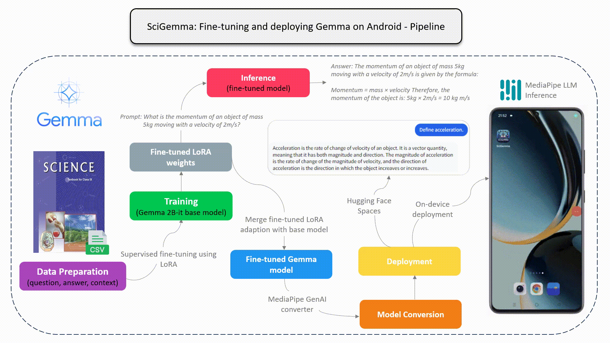
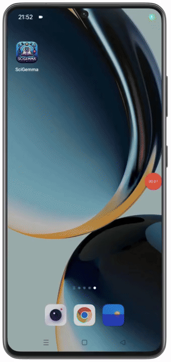

#### Developed by [Aashi Dutt](https://linkedin.com/in/aashi-dutt) and [Nitin Tiwari](https://linkedin.com/in/tiwari-nitin).

# Gemma on Android
This project is an implementation of fine-tuning the Gemma 2b-it model on a custom dataset and deploy the fine-tuned model on Android.


## Pipeline:




## Demo Output:




## Steps to run:

1. Clone the repository on your local machine.
2. Open the project in Android Studio.
3. Edit ```InferenceModel.kt``` file on **Line 44** by replacing ```YOUR_MODE_NAME.bin``` with the actual name of your model.
4. Build the project.
5. Install the Android app on your phone and enjoy using SciGemma.


## Resources:

1. Follow along three blog series explaining the code in detail:
   
   Part 1: [Step-by-Step Dataset Creation- Unstructured to Structured](https://aashi-dutt3.medium.com/part-1-step-by-step-dataset-creation-unstructured-to-structured-70abdc98abf0)

   Part 2: [Fine Tune - Gemma 2b-it model](https://aashi-dutt3.medium.com/part-2-fine-tune-gemma-2b-it-model-a26246c530e7)

   Part 3: [Deploying SciGemma on Android](https://tiwarinitin1999.medium.com/part-3-deploy-gemma-on-android-5bac532c54b7)

3. Fine-tuned model on 🤗: https://huggingface.co/NSTiwari/fine_tuned_science_gemma2b-it

4. Try our model on HFSpaces: [https://huggingface.co/spaces/Aashi/NSTiwari-fine_tuned_science_gemma2b-it?logs=container](https://huggingface.co/spaces/Aashi/NSTiwari-fine_tuned_science_gemma2b-it)

5. Checkout demo video on YouTube: https://www.youtube.com/watch?v=T_HDsVHTrwg

