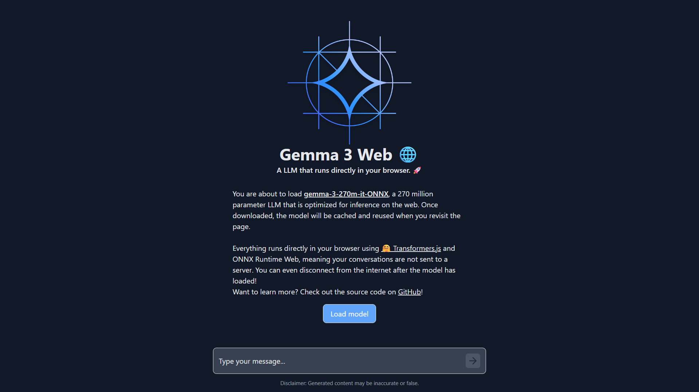

### Developed by [Sitam Meur](https://linkedin.com/in/sitammeur).

# Inference Gemma 3 on the browser with ONNX & Transformers.js

This is a simple web app that demonstrates how to use the [Gemma 3 270M](https://huggingface.co/onnx-community/gemma-3-270m-it-ONNX) model in the browser using [Transformers.js](https://huggingface.co/docs/transformers.js) and ONNX Runtime Web. The application allows users to chat with the Gemma 3 270M model and receive real-time responses.

## Project Structure

The project is structured as follows:

- `assets/`: This directory contains screenshots of the end application.

- `public/`: Static assets like images, icons, and fonts.

- `src/`: Core source code for the application.

  - `components/`: Reusable React components for the application.

    - `icons/`: Icon components for the application.

      - `ArrowRightIcon.jsx`: Arrow right icon component.
      - `BotIcon.jsx`: Bot icon component.
      - `StopIcon.jsx`: Stop icon component.
      - `UserIcon.jsx`: User icon component.

    - `Chat.jsx`: Chat component for displaying chat messages.
    - `Progress.jsx`: Progress component for displaying progress bar.

  - `styles/`: CSS files for styling the application.

    - `index.css`: Global CSS styles for the application.
    - `Chat.css`: CSS styles for the chat interface.

  - `worker.js`: Transformers.js worker for running the Gemma 3 model.
  - `App.jsx`: Main React component for the application.
  - `main.jsx`: Entry point for the application.

- `.gitignore`: Specifies which files and directories should be ignored by Git.
- `README.md`: Project documentation and setup instructions.
- `index.html`: Main HTML file for the application.
- `package.json`: Project dependencies and script configuration.
- `tailwind.config.js`: Tailwind CSS configuration file.
- `vite.config.js`: Vite configuration file for the project.

## Technologies Used

- **HTML**: Standard markup language for creating web pages.
- **Tailwind CSS**: Utility-first CSS framework for styling web applications.
- **JavaScript**: High-level programming language for building web applications.
- **React**: JavaScript library for building user interfaces.
- **Transformers.js**: JavaScript library for running Hugging Face models in the browser.

## Getting Started

To get started with this project, follow the steps below:

1. Clone the repository: `git clone https://github.com/google-gemini/gemma-cookbook.git`
2. Change the directory: `cd gemma-cookbook/Demos/Gemma3-on-Web`
3. Install the required dependencies: `npm install`
4. Run the application: `npm run dev`

Open your local host to view the web application in your browser at `http://localhost:5173/`.

> [!NOTE]  
> For the first time, it will take around 10-15 minutes to load the model weights.

## Results

**Note**: To see results, please refer to the `assets` folder in the repository.

## Resources & References

1. [Google for Developers Article](https://developers.googleblog.com/en/introducing-gemma-3-270m/)
2. [Hugging Face ONNX Model](https://huggingface.co/onnx-community/gemma-3-270m-it-ONNX)
3. [Transformers.js GitHub](https://github.com/huggingface/transformers.js)
4. [ONNX Community](https://huggingface.co/onnx-community)
