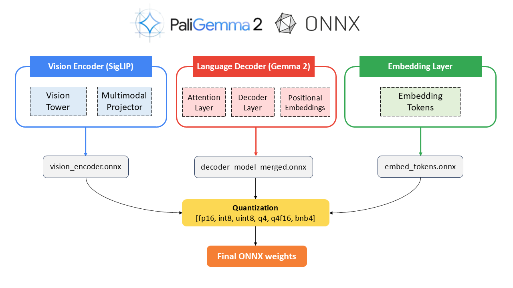

### Developed by [Nitin Tiwari](https://linkedin.com/in/tiwari-nitin).

# Inference PaliGemma 2 on the browser with ONNX & Transformers.js
This project is an implementation of inferencing the paligemma2-3b-mix-224 model on the browser using its converted ONNX weights and Hugging Face Transformers.js.

## PaliGemma 2 to ONNX Conversion:

## Steps to run:

1. Clone the repository on your local machine.
2. Navigate to `gemma-cookbook/Demos/PaliGemma2-on-Web` directory.
3. Run `npm install` to install the Node.js packages.
4. Run `node server.js` to start the server.
5. Open `localhost:3000` on your web browser and start inferencing with PaliGemma 2.

> [!NOTE]  
> For the first time, it will take around 10-15 minutes to load the model weights.

## Results:

## Resources & References

1. [Google DeepMind PaliGemma 2](https://developers.googleblog.com/en/introducing-paligemma-2-mix/)
2. Colab Notebooks: 
<table>
  <tr>
    <td><b>Convert and quantize PaliGemma 2 to ONNX</b></td>
    <td></td>
  </tr>
  <tr>
    <td><b>Inference PaliGemma 2 with Transformers.js</b></td>
    <td></td>
  </tr>
</table>

3. [**Medium Blog**](https://medium.com/@tiwarinitin1999/inference-paligemma-2-with-transformers-js-5545986ac14a) for step-by-step implementation.
4. [ONNX Community](https://huggingface.co/onnx-community)
