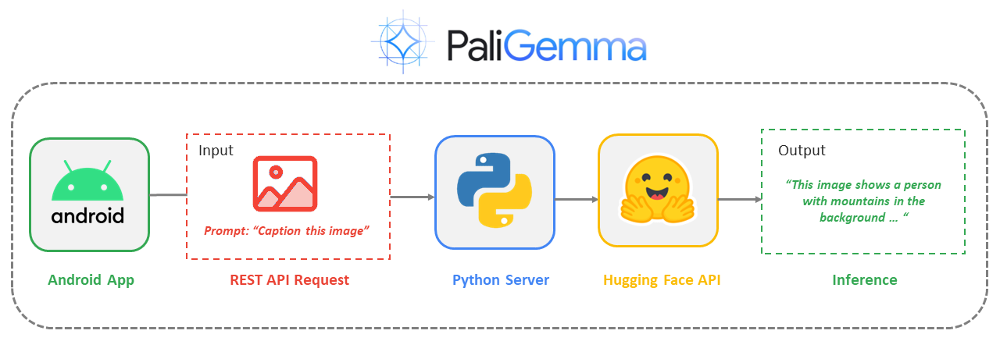

#### Developed by [Nitin Tiwari](https://linkedin.com/in/tiwari-nitin), [Sagar Malhotra](https://linkedin.com/in/sagar0-0malhotra) and [Savio Rodrigues](https://x.com/sloathee).

# PaliGemma Android HF
This repository is an implementation of inferring the PaliGemma Vision Language Model on Android using Hugging Face-Gradio Client API for tasks such as zero-shot object detection, image captioning and visual question-answering.

## Pipeline:

## Demo Outputs:

**Visual question-answering, zero-shot object detection, image captioning**

**Reference Expression Segmentation**

