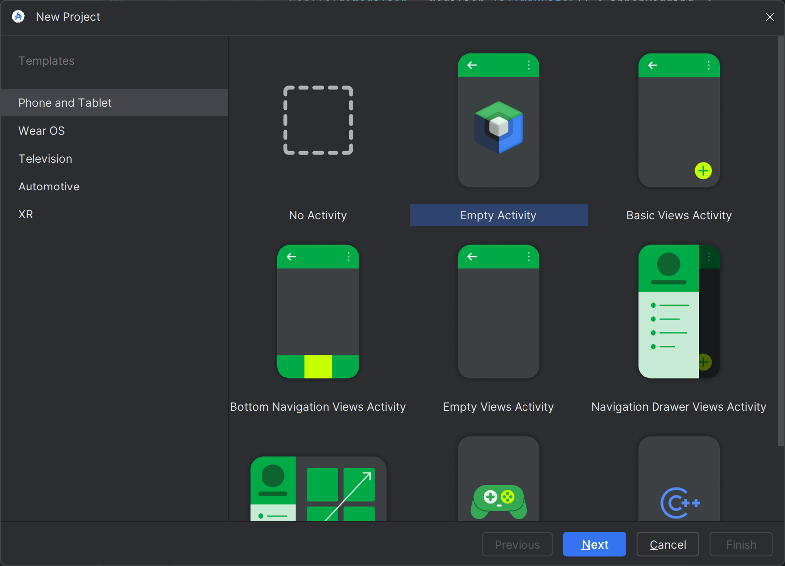
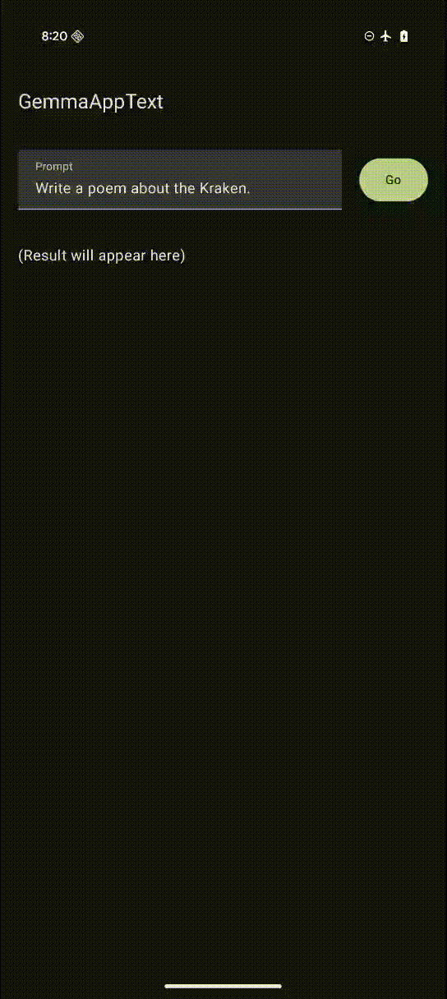

# Getting Started with Gemma on Android 🚀

This guide provides the resources and instructions to integrate the Gemma model into your Android applications. We offer two boilerplate projects to get you started quickly.

## Boilerplate Projects (Quickstart)

The easiest way to start is by using one of the provided boilerplate projects. They are already configured with all the necessary dependencies, UI components, and model integration logic.

- GemmaAppText : A minimal-implementation example that uses **text-only** input.
- GemmaAppImage : A minimal-implementation example that uses **image + text** input.

### Quickstart Steps:

1. **Open** the chosen project (`GemmaAppText` or `GemmaAppImage`) in Android Studio.
2.  **Download** the `Gemma 3n` model from [Kaggle](https://www.kaggle.com/models/google/gemma-3n/tfLite).
3.  **Push the model** to your test device using the Android Debug Bridge (adb):
    ```bash
    $ adb shell mkdir -p /data/local/tmp/llm/
    $ adb push gemma-3n-E2B-it-int4.task /data/local/tmp/llm/
    ```
4.  **Run** the app.

## Manual Integration Guide

If you prefer to integrate Gemma into a new or existing project like "Empty Activity", follow these steps.



### 1. Add Dependencies

First, you need to add the required MediaPipe libraries to your project. The dependencies differ slightly depending on whether you are using text-only or multi-modal input.

#### In `app/build.gradle.kts`

Choose the set of dependencies for your use case:

**For Text-Only Input (`GemmaAppText`):**

```kotlin
dependencies {
    implementation(libs.androidx.lifecycle.viewmodel.compose)
    implementation(libs.mediapipe.tasks.genai)
}
```

**For Image + Text Input (`GemmaAppImage`):**

```kotlin
dependencies {
    implementation(libs.androidx.lifecycle.viewmodel.compose)
    implementation(libs.mediapipe.tasks.text)
    implementation(libs.mediapipe.tasks.genai)
}
```

#### In `gradle/libs.versions.toml`

Add the corresponding entries to your `libs.versions.toml` file:

**For Text-Only Input (`GemmaAppText`):**

```toml
# In the [versions] block
lifecycleViewmodelCompose = "2.9.2"
mediapipeTasksGenai = "0.10.25"

# In the [libraries] block
androidx-lifecycle-viewmodel-compose = { group = "androidx.lifecycle", name = "lifecycle-viewmodel-compose", version.ref = "lifecycleViewmodelCompose" }
mediapipe-tasks-genai = { group = "com.google.mediapipe", name = "tasks-genai", version.ref = "mediapipeTasksGenai" }
```

**For Image + Text Input (`GemmaAppImage`):**

```toml
# In the [versions] block
lifecycleViewmodelCompose = "2.9.2"
mediapipeTasksText = "0.20230731"
mediapipeTasksGenai = "0.10.25"

# In the [libraries] block
androidx-lifecycle-viewmodel-compose = { group = "androidx.lifecycle", name = "lifecycle-viewmodel-compose", version.ref = "lifecycleViewmodelCompose" }
mediapipe-tasks-text = { group = "com.google.mediapipe", name = "tasks-text", version.ref = "mediapipeTasksText" }
mediapipe-tasks-genai = { group = "com.google.mediapipe", name = "tasks-genai", version.ref = "mediapipeTasksGenai" }
```

### 2. Download and Deploy the Model

(This step is the same for both text and image apps)

Download the **Gemma 3n** model from [Kaggle](https://www.kaggle.com/models/google/gemma-3n/tfLite).

Next, push the downloaded `.task` file to your Android device.

```bash
$ adb shell mkdir -p /data/local/tmp/llm/
$ adb push gemma-3n-E2B-it-int4.task /data/local/tmp/llm/
```

> **Note**: For development, using `adb` to push the model to your device is fine. For a production app, you should host the model on a server and download it at runtime, as the model file is too large to be bundled directly within your APK.

### 3. Add Resources

The necessary resources depend on the app type.

**For Text-Only Input (`GemmaAppText`):**

Add the following to `app/src/main/res/values/strings.xml` 

```xml
<resources>
    <!-- Other strings... -->
    <string name="action_go">Go</string>
    <string name="action_stop">Stop</string>
    <string name="label_prompt">Prompt</string>
    <string name="prompt_placeholder">Write a poem about the Kraken.</string>
    <string name="result_placeholder">(Result will appear here)</string>
</resources>
```

**For Image + Text Input (`GemmaAppImage`):**

1. **Copy Images:** Copy sample JPEG files to the `app/src/main/res/drawable` directoy.
2. **Add Strings:** Add the following to `app/src/main/res/values/strings.xml`

```xml
<resources>
    <!-- Other strings... -->
    <string name="action_go">Go</string>
    <string name="action_stop">Stop</string>
    <string name="label_prompt">Prompt</string>
    <string name="prompt_placeholder">Describe this image in detail.</string>
    <string name="kitchen_description">Kitchen</string>
    <string name="sunset_description">Sunset</string>
    <string name="surprise_description">Surprise</string>
    <string name="result_placeholder">(Result will appear here)</string>
</resources>
```

### 4. Copy Sample Code

To get the UI and model logic working quickly, copy the following files from either `GemmaAppText` or `GemmaAppImage` boilerplate into your project:

  * **UI and State Management:**
      * `ChatScreen.kt`
      * `ChatViewModel.kt`
      * `UiState.kt`
  * **Model Wrapper:**
      * `GemmaModel.kt` (This class wraps the model and sets default configuration.)

> **Important**: After copying the files, you must update the `package` declaration at the top of each Kotlin file to match your project's package name. For example:

```kotlin
package com.example.myapplication // Change this to your app's package name
```

### 5. Update MainActivity

(This step is the same for both text and image apps)

Finally, modify your `MainActivity.kt` to use the new `ChatScreen` Composable. Replace the default `setContent` block with the following:

```kotlin
    setContent {
        MyApplicationTheme { // Or your app's theme
            ChatScreen()
        }
    }
```

After completing these steps, you can run your app to see the Gemma-powered chat interface in action.

`GemmaAppText`



`GemmaAppImage`


